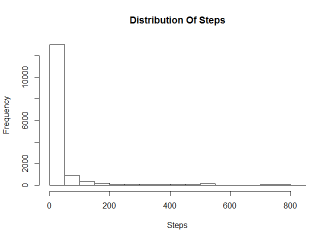
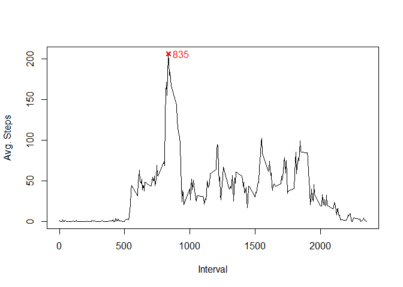
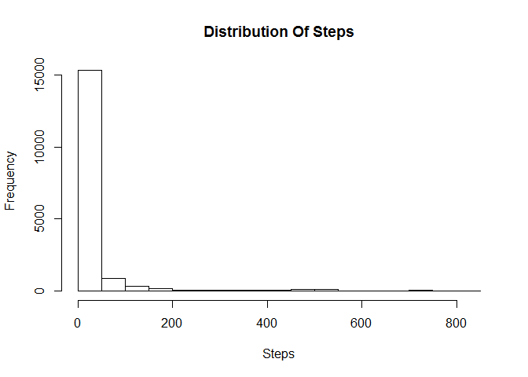
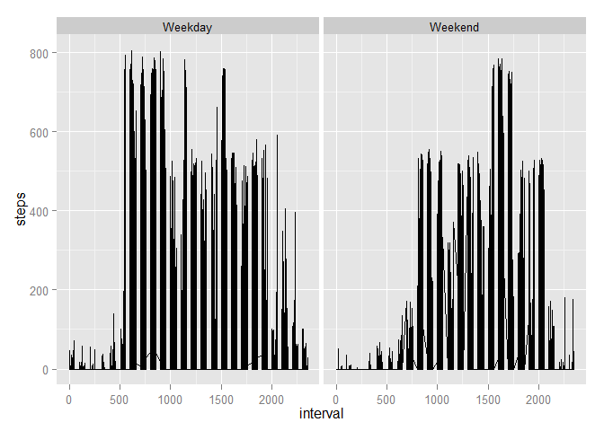

# Reproducible Research: Peer Assessment 1


## Loading and preprocessing the data

unzip the files

```r
unzip("activity.zip")
```

Read the csv file into activity data set

```r
activity <- read.csv(file="activity.csv", header=TRUE)
```

Convert date variable into date format

```r
activity$date <- as.Date(activity$date, "%Y-%m-%d")
```

Print summary statistics of the data

```r
summary(activity)
```

```
##      steps             date               interval     
##  Min.   :  0.00   Min.   :2012-10-01   Min.   :   0.0  
##  1st Qu.:  0.00   1st Qu.:2012-10-16   1st Qu.: 588.8  
##  Median :  0.00   Median :2012-10-31   Median :1177.5  
##  Mean   : 37.38   Mean   :2012-10-31   Mean   :1177.5  
##  3rd Qu.: 12.00   3rd Qu.:2012-11-15   3rd Qu.:1766.2  
##  Max.   :806.00   Max.   :2012-11-30   Max.   :2355.0  
##  NA's   :2304
```


## What is mean total number of steps taken per day?

Make hist of steps by ignoring NA

```r
hist(activity$steps, xlab="Steps", main="Distribution Of Steps")
```

 


Get the mean of the steps by ignoring NA

```r
mean(activity$steps, na.rm=TRUE)
```

```
## [1] 37.3826
```

Get the median of the steps by ignoring NA

```r
median(activity$steps, na.rm=TRUE)
```

```
## [1] 0
```


## What is the average daily activity pattern?

I shall use dplyr package for this

```r
library(dplyr)
```

```
## 
## Attaching package: 'dplyr'
## 
## The following objects are masked from 'package:stats':
## 
##     filter, lag
## 
## The following objects are masked from 'package:base':
## 
##     intersect, setdiff, setequal, union
```

Calculate Average Steps for each interval

```r
avgsteps <- activity %>% tbl_df() %>% select(steps, interval) %>%
  group_by(interval) %>% summarise(meansteps=mean(steps, na.rm=TRUE))
```

Plot the Average steps for each Interval

```r
plot(avgsteps$interval, avgsteps$meansteps, type="l",
     ylab="Avg. Steps", xlab="Interval")

## Identify the 5 minute interval that contains the max avg steps for all days
points(avgsteps[avgsteps$meansteps==max(avgsteps$meansteps), c("interval")],
       avgsteps[avgsteps$meansteps==max(avgsteps$meansteps), c("meansteps")],
       col="red",
       pch=4,
       lwd=2)
text(avgsteps[avgsteps$meansteps==max(avgsteps$meansteps), c("interval")]+100,
     avgsteps[avgsteps$meansteps==max(avgsteps$meansteps), c("meansteps")],
     avgsteps[avgsteps$meansteps==max(avgsteps$meansteps), c("interval")],
     col="red")
```

 

As you can see, MAX Number of Steps is observed at Interval 835

## Imputing missing values

Lets look at the total number of missing values

```r
sum(is.na(activity$steps) | is.na(activity$date) | is.na(activity$interval))
```

```
## [1] 2304
```
I will calculate the median of steps for each interval and use that to replace missing values


```r
activityd <- tbl_df(activity)
medsteps <- activity %>% tbl_df() %>% select(steps, interval) %>%
  group_by(interval) %>% summarise(medsteps=median(steps, na.rm=TRUE))

activitymissingtreat <- inner_join(activityd, medsteps,
                                   by=c("interval"))
```

Replace missing values

```r
activitymissingtreat[is.na(activitymissingtreat$steps), c("steps")] <-
  activitymissingtreat[is.na(activitymissingtreat$steps), c("medsteps")]


activity <- select(activitymissingtreat, steps, date, interval)
```

Make hist of steps post missing values treatment

```r
hist(activity$steps, xlab="Steps", main="Distribution Of Steps")
```

 

Get the mean of the steps post missing value treatment

```r
mean(activity$steps)
```

```
## [1] 32.99954
```

Get the median of the steps post missing value treatment

```r
median(activity$steps)
```

```
## [1] 0
```

As you can see post imputing missing data the mean has fallen by 5 and median is intact at 0

## Are there differences in activity patterns between weekdays and weekends?

I am creating a new factor variable that has two levels, weekday and weekend


```r
activity$day <- NA
activity[weekdays(activity$date) %in% c("Saturday", "Sunday"),
         c("day")]<- "Weekend"

activity[!(weekdays(activity$date) %in% c("Saturday", "Sunday")),
         c("day")]<- "Weekday"

activity$day <- as.factor(activity$day)
```

I will now build a panel plot using ggplot2 to compare the average steps taken during weekdays and weekends

Import ggplot2

```r
library(ggplot2)
```

Draw panel plot using qplot

```r
qplot(interval, steps, data=activity, geom=c("line"), facets =.~day)
```

 

On weekdays the MAX Steps is observed before interval 1000 and on weekends it is observed only post 1500 interval
